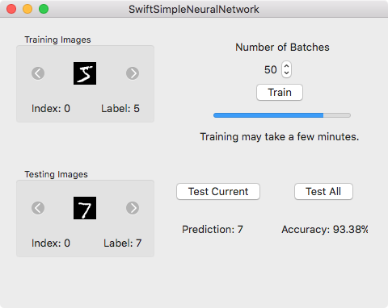

# SwiftSimpleNeuralNetwork
A simple multi-layer feed-forward neural network with backpropagation built in Swift.

## Philosophy
This *teaching* project is proclaimed *simple* for two reasons:
- The code aims to be simple to understand (even at the expense of performance). I built this project to learn more about implementing neural networks. It does not aim to be state of the art or feature complete, but instead approachable.
- The type of neural network targetted is very specific - only multi-layer feed-forward backpropagation networks. Why? Because we're keeping it simple,

Contributions to the project will be measured not only by their functional aspects (improved performance, more features) but also by how much they stick to the philosophy.

## Installation

**The project requires Xcode 9 and Swift 4.**

### Manual

For the present, the best way to try the project out is through the wine and iris Xcode unit tests. Just download or clone the repository and run them from within Xcode.

### SPM

You can also install the project's main files (but not the unit tests) through SPM via this repository.

## Mac Example App

The example app for macOS that comes with SwiftSimpleNeuralNetwork trains on 60,000 MNIST sample images and then predicts another 10,000 testing images. In my testing it reaches as high as 94% accuracy without much tuning (just many batches of training on the full dataset). This is definitely not state of the art, but for a *simple* neural network, it's a decent demonstration.

## Unit Tests

A check indicates a test is passing/working.
- [x] `IrisTest.swift` uses the classic data set (contained in `iris.csv`) to classify 150 irises by four attributes.
- [x] `WineTest.swift` uses a data set of 178 wines across thirteen attributes (contained in `wine.csv`) to classify wines by cultivar (three cultivars total). The test trains on the first 150 and then validates itself by classifying the remaining 28.
- [ ] `SinTest.swift` tries to learn to approximate the sin() function. ~80% of predictions come close to correct values.

## License, Contributions, and Attributions

SwiftSimpleNeuralNetwork is Copyright 2016 David Kopec and licensed under the Apache License 2.0 (see LICENSE). As per the Apache license, contributions are also Apache licensed by default. And contributions are welcome!

The wine and iris datasets in the unit tests are provided curtosy of the UCI Machine Learning Repository which should be cited as:
> Lichman, M. (2013). UCI Machine Learning Repository [http://archive.ics.uci.edu/ml]. Irvine, CA: University of California, School of Information and Computer Science.

The MNIST dataset is from [LeCun, Cortes, and Burges](http://yann.lecun.com/exdb/mnist/).

The overall neural network algorithm implemented throughout the project was derived primarily from Chapter 18 of Artificial Intelligence: A Modern Approach (Third Edition) by Stuart Russell and Peter Norvig.

A few small individual utility functions in `Functions.swift` are from third party sources and cited appropriately in-source.

## Future Directions

- Improved in-source documentation
- Improved documentation in this README
- More unit tests
- More activation functions
- Utility function to archive (serialize) and recreate (deserialize) trained neural networks
- Better testing of networks with more than one layer
- Improved performance
